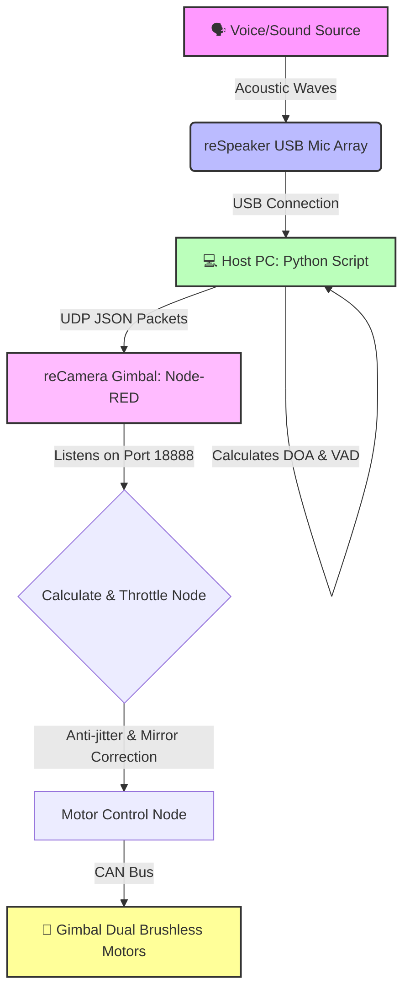

# 🎯 reCamera Gimbal Sound-Tracking System

[中文](README_zh.md) | [English](README.md)


Welcome to the **reCamera Gimbal Sound-Tracking** project! This repository demonstrates how to integrate the **reSpeaker USB Mic Array** with the **reCamera Gimbal** (a RISC-V & YOLO11n powered AI camera) to create an intelligent edge AI system that "hears" and automatically physically tracks sound sources in real-time.

## 🌟 Project Overview
By utilizing Sound Source Localization (DOA - Direction of Arrival) from the reSpeaker, the host PC captures the audio direction and triggers the reCamera Gimbal's brushless motors via UDP over Wi-Fi. Wherever the sound comes from, the camera turns to look!

## 🛠 Hardware Requirements
- **reCamera Gimbal**: A RISC-V based Linux AI camera with dual brushless motors (Yaw: 0-360°, Pitch: 0-180°).
- **reSpeaker USB 4-Mic Array**: For high-precision sound source localization.
- **Host PC**: To run the Python bridge script.

## ⚙️ How It Works


## 📦 Software Setup & Installation

### 1. Python Environment (Host PC)
To communicate with the reSpeaker via USB, install the dependencies on your PC:
```bash
# Install required Python packages from the provided requirements file
pip install -r reCamera_speaker/requirements.txt

# Install libusb via Conda (Crucial for backend driver support)
conda install -c conda-forge libusb
```

### 2. Node-RED Configuration (reCamera Gimbal)
Follow these exact steps to deploy the workflow on your reCamera Gimbal:
1. Open your browser and go to `http://192.168.42.1` to access the reCamera Gimbal's Node-RED interface.
2. Click the bottom-left corner to log in to **SenseCraft**.
3. After logging in, click the **"+"** icon next to **"My Application"** on the bottom left to create a new application.
4. Inside the newly created Application, click the **three grey horizontal lines** (hamburger menu) in the top-right corner, and select **Import**.
5. Click **"Import Node File"**, navigate to the `Node-RED_JSON` folder in this repository, select `flows (23).json`, and click **Import**.
6. Click the green **"Deploy"** button in the top-right corner.
7. Switch to the second **"Dashboard"** tab at the top to view the current workflow. You can safely delete the default blank Dashboard tab.

## 🚀 Operation & Important Notes
1. **Deployment**: Always remember to click the **Deploy** button in Node-RED after importing the nodes to apply the configuration.
2. **Test Mechanism**: First, ensure Node-RED is running on the reCamera. Then, run the Python script on your PC by executing:
   ```bash
   python reCamera_speaker/server.py
   ```
   Speak into the microphone—you should see the Python terminal continuously printing `SPEECH_DETECTED: 1`, while the reCamera rapidly turns towards the angle of your voice.
3. **Physical Orientation Calibration**: The `0°` orientation of the reSpeaker mic array might not perfectly align with the default `0°` front of the reCamera. If you notice a consistent offset (e.g., it always points 90 degrees away), simply double-click the `Calculate & Throttle` function node in Node-RED, uncomment the offset line, and modify it: `targetYaw = (targetYaw + 90) % 360;`.
4. **Anti-jitter Design**: The Python script refreshes every 0.1 seconds. Pushing all these rapid signals directly to the motor controllers (CAN bus) could overload and freeze the device. To prevent this, we implemented an anti-jitter logic inside the Node-RED function node: it only triggers the motors if the angle changes by `>5°` or the time interval is `>1 second`.

## 💡 Extend This Project!
This repository is just the beginning! You are highly encouraged to fork this project and extend its capabilities. For example:
- **Trigger Actions**: Modify the Python or Node-RED script to make the reCamera automatically start **recording a video** or **snapping a picture** once it faces the sound source.
- **Smart Security**: Integrate it with Home Assistant to track unusual noises in a room.
- **AI Vision + Audio**: Combine YOLO11n object detection with audio tracking (e.g., hear a sound, turn around, and verify if it's a "person").

Happy Hacking! 🎉
