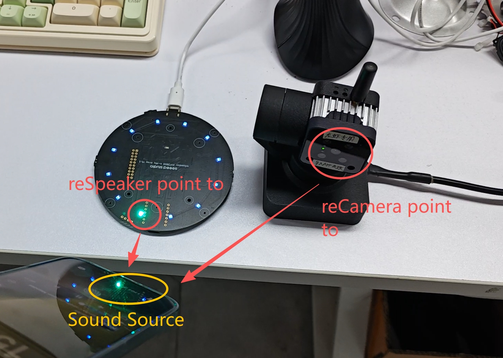
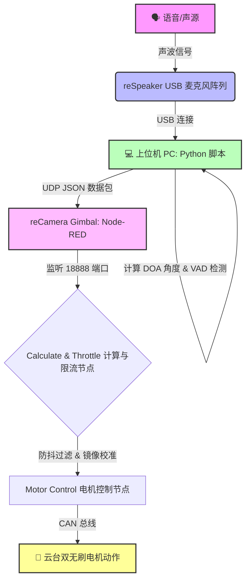

# 🎯 reCamera Gimbal 听声辨位追踪系统

[English](README.md) | [中文](README_zh.md)



欢迎来到 **reCamera Gimbal 听声辨位追踪** 项目！本仓库展示了如何将 **reSpeaker USB 麦克风阵列** 与基于 RISC-V 和 YOLO11n 架构的 **reCamera Gimbal（云台相机）** 结合，打造一个能“听”并自动在物理世界中追踪声源的边缘 AI 系统。

## 🌟 项目简介
通过利用 reSpeaker 的声源定位技术（DOA - 波达方向测定），上位机 PC 可以捕捉声音的方向，并通过 Wi-Fi 以 UDP 协议触发 reCamera Gimbal 的无刷电机。无论声音从哪里传来，相机的镜头就会立刻转向哪里！

## 🛠 硬件需求
- **reCamera Gimbal**: 基于 RISC-V 的 Linux AI 相机，自带双无刷电机（偏航轴：0-360°，俯仰轴：0-180°）。
  https://www.seeedstudio.com/reCamera-Gimbal-2002w-8GB-p-6402.html
- **reSpeaker USB 4-Mic Array**: 4麦克风阵列，用于高精度声源定位。  
  https://www.seeedstudio.com/ReSpeaker-XVF3800-USB-Mic-Array-p-6488.html
- **上位机 PC**: 用于运行 Python 中继脚本。

## ⚙️ 系统工作原理 (How It Works)


## 📦 软件安装与配置

### 1. Python 环境配置 (上位机 PC)
为了通过 USB 与 reSpeaker 进行通信，请在你的电脑上安装以下依赖：
```bash
# 通过提供的 requirements 文件快速安装 Python 依赖库
pip install -r Sound-Tracking/requirements.txt

# 通过 Conda 安装 libusb (底层驱动支持，必装)
conda install -c conda-forge libusb
```

### 2. Node-RED 配置 (reCamera Gimbal 端)
请严格按照以下步骤将工作流部署到你的 reCamera Gimbal：
1. 打开浏览器，输入 `192.168.42.1` 进入 reCamera Gimbal 的 Node-RED 界面。
2. 点击左下角登录 **SenseCraft**。
3. 登陆后，点击左下角 **“My Application”** 右边的 **“+”** 号，创建新的 Application。
4. 在新创建的 Application 中，点击右上角的 **三条灰色横杠标志（菜单）**，选择 **导入**。
5. 点击 **“导入节点文件”**，找到本仓库 `Node-RED_JSON` 文件夹下的 `flows (23).json` 文件，然后点击 **“导入”**。
6. 接着点击右上角绿色的 **“部署”** 按钮。
7. 你需要切换到上方第二个 **“Dashboard”** 选项卡才能看到当前工作流，你可以将默认的那个空白 Dashboard 删掉。

## 🚀 运行说明与注意事项
1. **部署确认**：在 Node-RED 导入上述节点后，**务必**点击右上角的“部署”按钮以生效配置。
2. **测试机制**：先启动 Node-RED 确保其在后台运行，然后在 PC 上执行以下命令运行 Python 脚本：
请在 reSpeaker.py 代码中，将 "192.168.31.198" 替换为 reCamera Gimbal 连接到 WiFi 后的实际 IP 地址!
   ```bash
   python Sound-Tracking/reSpeaker.py
   ```
   对着麦克风说话，你应该能看到 Python 终端不断打印 `SPEECH_DETECTED: 1`，同时 reCamera 将快速转向该声音所在的物理角度。
4. **物理朝向校准**：reSpeaker 麦克风阵列的 `0度` 朝向可能和 reCamera 默认的 `0度` 正前方不完全一致。如果你发现云台转过去后总是偏离一个固定的角度（比如总是偏了90度），你可以直接双击 Node-RED 里新建的 `Calculate & Throttle` 函数节点，解除相关代码的注释并修改偏移量计算：`targetYaw = (targetYaw + 90) % 360;`。
5. **防抖设计**：因为 Python 代码是每 0.1 秒刷新一次发送数据，如果把这些高频信号全部推给电机控制器（CAN 总线），很容易造成设备总线过载而卡死。所以我已经在 Node-RED 的函数节点里写好了防抖逻辑（只有当角度变化 `>5°` 或时间间隔 `>1秒` 时才会触发电机转动）。

## 💡 拓展更多玩法！
这个 Demo 只是一个开始，我们非常鼓励大家在此基础上进行二次开发，拓展更多硬核玩法！例如：
- **触发联动**：你可以修改 Node-RED 或 Python 脚本，让 reCamera Gimbal 在转向声源位置后，**立刻开始录像** 或 **拍下照片**。
- **智能安防**：结合 Home Assistant，在房间出现异常响动时自动追踪记录。
- **视觉+听觉双重确认**：将 YOLO11n 的目标检测与听觉追踪结合（例如：听到声音 -> 转过去看 -> 视觉识别确认是否是“人”）。

期待看到你们的创意！🎉
